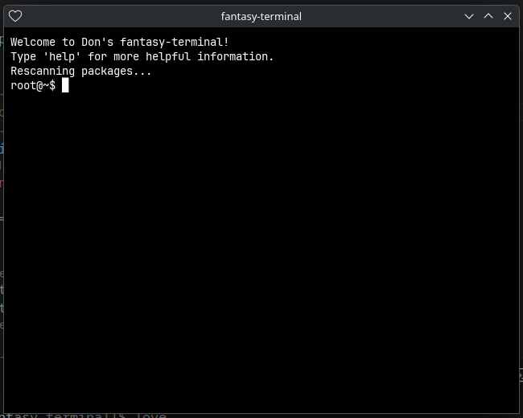

# fantasy-terminal



**fantasy-terminal** is a fantasy computer environment built with [LÖVE](https://love2d.org/).
It provides a virtual terminal, support for user-created apps, and a built‑in **package manager** for managing community‑contributed software.

> [!NOTE]
> **Font License**  
> The included font [JetBrains Mono](https://www.jetbrains.com/lp/mono/) (`jbmono.ttf`) is licensed under the [SIL Open Font License 1.1](docs/OFL.txt).

---

## Features

* ✅ Virtual terminal
* ✅ App support
* ✅ **Built‑in package manager (APM)** for installing/removing/rescanning packages

---

## Requirements

* [LÖVE 11.x or 12.x](https://love2d.org/) (LÖVE 12.x adds file picker support, 11.x falls back to manual install)
* [Lua 5.1](https://www.lua.org/) (required by LuaSec)
* [LuaRocks](https://luarocks.org/)

On Arch Linux:

```bash
sudo pacman -S love lua51 luarocks
```

Other platforms:

* Install LÖVE from [love2d.org](https://love2d.org/).
* Install Lua 5.1 (can coexist with newer Lua versions).
* Install LuaRocks from your package manager or [source](https://luarocks.org/).

---

## Installation

### 1. Clone and enter the project

```bash
git clone https://github.com/thedonjb/fantasy-terminal
cd fantasy-terminal
```

### 2. Initialize a project-local LuaRocks tree

This creates an isolated environment for dependencies:

```bash
luarocks --lua-version=5.1 init --local
```

### 3. Activate the environment

Before running or installing modules, set up the package paths to point to the project’s `lua_modules/` tree:

```bash
eval "$(luarocks --lua-version=5.1 path --tree=lua_modules)"
```

### 4. Install dependencies

```bash
luarocks --lua-version=5.1 --tree=lua_modules install --only-deps fantasy-terminal-scm-1.rockspec
```

This will pull in modules such as `luasec` and `dkjson` into `lua_modules/`.

### 5. Run fantasy-terminal

```bash
love .
```

---

## Package Manager (APM)

fantasy-terminal includes **APM** (App Package Manager) out of the box.
It automatically rescans installed packages on startup and also supports an `~/.ltrc` file for custom startup commands.

### Installing packages

You can install `.fpkg.lua` packages from the terminal:

```bash
apm install mypackage.fpkg.lua
```

On **LÖVE 12.x**, a file picker will open if no file is provided.
On **LÖVE 11.x**, the appnet folder will open in your file manager. Drop your package there and run:

```bash
apm rescan
```

### Listing installed packages

```bash
apm list
```

### Removing packages

```bash
apm remove <name>
```

### Getting package info

```bash
apm info <name>
```

### Rescanning manually

```bash
apm rescan
```

---

## `.ltrc` Startup File

You can create a file at `ftermfs/home/.ltrc` to auto-run commands at startup, e.g.:

```
apm rescan
fortune
```

fantasy-terminal will execute each line on startup and warn you if the file is malformed.

---

## Development

* Dependencies are declared in `fantasy-terminal-scm-1.rockspec`.

* Install new dependencies into the project tree with:

  ```bash
  luarocks --lua-version=5.1 --tree=lua_modules install <module>
  ```

* Commit changes to the rockspec if new dependencies are required.

* The `.gitignore` excludes `lua_modules/`, `.luarocks/`, `.vscode/`, and other local files so the repo stays clean.

---

## Quick Start

```bash
git clone https://github.com/thedonjb/fantasy-terminal
cd fantasy-terminal
luarocks --lua-version=5.1 init --local
eval "$(luarocks --lua-version=5.1 path --tree=lua_modules)"
luarocks --lua-version=5.1 --tree=lua_modules install --only-deps fantasy-terminal-scm-1.rockspec
love .
```